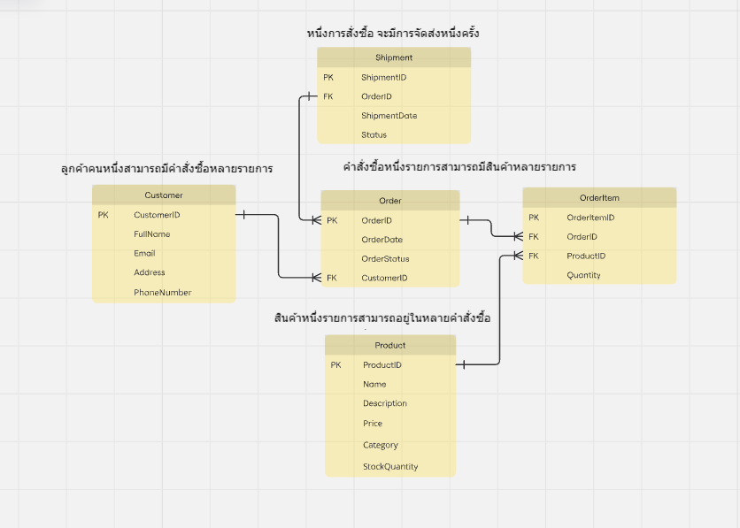

ออกแบบ ER Diagram แบบ Relational Database ที่เหมาะสมสำหรับระบบนี้ โดยระบุ:
1. ตารางต่างๆ ที่ควรจะมีในฐานข้อมูล

    ตารางข้อมูลสินค้า (Product)
    ตารางลูกค้า (Customer)
    ตารางการสั่งซื้อ (Orders)
    ตารางรายการสั่งซื้อ (OrderItems)
    ตารางการจัดส่ง (Shipments)

2. ฟิลด์สำคัญในแต่ละตาราง
    ตารางข้อมูลสินค้า (Product)
        ProductID (Primary Key)  รหัสสินค้า
        Name                     ชื่อสินค้า
        Description              รายละเอียดสินค้า
        Price	                 ราคาสินค้า
        Category	             หมวดหมู่สินค้า
        StockQuantity            ปริมาณในสต็อก

    ตารางลูกค้า (Customer)
        CustomerID (Primary Key)  รหัสลูกค้า 
        FullName                  ชื่อ-นามสกุล
        Email                     อีเมล
        Address                   ที่อยู่  
        PhoneNumber               เบอร์โทรศัพท์

    ตารางการสั่งซื้อ (Order)
        OrderID (Primary Key)     เลขที่ใบสั่งซื้อ
        OrderDate                 วันที่สั่งซื้อ
        CustomerID (Foreign Key)  รหัสลูกค้า 
        OrderStatus               สถานะการสั่งซื้อ

    ตารางรายการสั่งซื้อ (OrderItem)     
        OrderItemID (Primary Key) รหัสรายการ
        OrderID (Foreign Key)     เลขที่ใบสั่งซื้อ  
        ProductID (Foreign Key)   รหัสสินค้า
        Quantity                  จำนวน

    ตารางการจัดส่ง (Shipments)
        ShipmentID (Primary Key)  เลขที่จัดส่ง
        OrderID (Foreign Key)     เลขที่ใบสั่งซื้อ
        ShipmentDate              วันที่จัดส่ง
        Status                    สถานะการจัดส่ง

3. ความสัมพันธ์ระหว่างตารางต่างๆ
Customer มีความสัมพันธ์แบบ One-to-Many กับ Order: ลูกค้าคนหนึ่งสามารถมีคำสั่งซื้อหลายรายการ
Order มีความสัมพันธ์แบบ One-to-Many กับ OrderItem: คำสั่งซื้อหนึ่งรายการสามารถมีสินค้าหลายรายการ
Product  มีความสัมพันธ์แบบ One-to-Many OrderItem: สินค้าหนึ่งรายการสามารถอยู่ในหลายคำสั่งซื้อ
Order มีความสัมพันธ์แบบ One-to-One กับ Shipment: คำสั่งซื้อหนึ่งรายการมีการจัดส่งเพียงหนึ่งครั้ง

4. อธิบายเหตุผลในการออกแบบดังกล่าว
    การออกแบบนี้ทำให้สามารถจัดการข้อมูลลูกค้า การสั่งซื้อ รายการสั่งซื้อ  ข้อมูลสินค้า และการจัดส่งโดยการแยกข้อมูลออกเป็นตารางต่างๆ ตามประเภทของข้อมูล เพื่อลดความซ้ำซ้อนของข้อมูล  และใช้ Primary Key และ Foreign Key ในการโยงความสัมพันธ์เพื่อให้เห็นได้ชัด และจัดการ Many-to-Many ด้วยตาราง OrderItem ทำให้สามารถซื้อสินค้าหลายชิ้นในคำสั่งซื้อเดียว หากมีการเปลี่ยนแปลงความต้องการของธุรกิจในอนาคต ระบบจะสามารถปรับปรุงได้โดยไม่กระทบโครงสร้างหลัก

Customer
---------
CustomerID (PK)
FullName
Email
Address
PhoneNumber

Product
--------
ProductID (PK)
Name
Description
Price
Category
StockQuantity

Order
------
OrderID (PK)
OrderDate
CustomerID (FK)
Status

OrderItem
----------
OrderItemID (PK)
OrderID (FK)
ProductID (FK)
Quantity

Shipment
---------
ShipmentID (PK)
OrderID (FK)
ShipmentDate
Status

